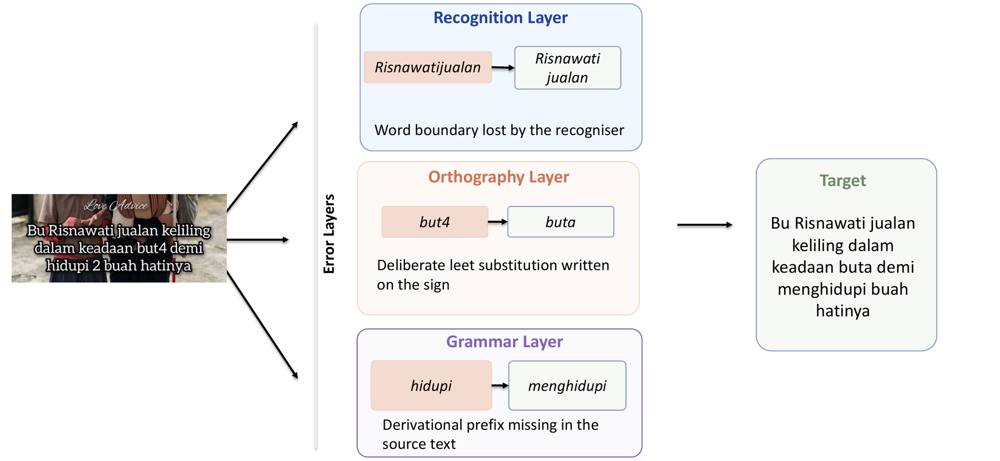
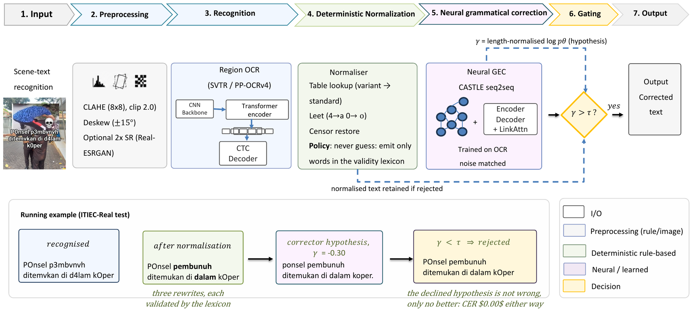

# VITEC — Knowledge-Constrained Normalisation and Selective Neural Correction for Indonesian Text-in-Image Errors

Code, knowledge resources, and evaluation artefacts for the paper of the same name.

<p align="center">
  
</p>
<p align="center"><sub><b>Figure 1.</b> One real ITIEC region carries errors from three layers at once:
a word boundary lost by the recogniser (<i>Risnawatijualan</i>), a deliberate leet substitution
(<i>but4</i>), and a missing derivational prefix (<i>hidupi</i>).</sub></p>

> **Note on repository history.** This repository supersedes an earlier code release
> that accompanied a previous draft of this work (IEEE-format, different evaluation
> protocol). That draft reported a synthetic-split score of 83.41% F₀.₅ computed with
> a different token-level scorer on a synthetic split that is no longer part of the
> released corpus, and several end-to-end numbers that were later found to be
> artefacts of two measurement bugs (region–reference misalignment and detokenisation
> spacing; see §RQ1 (measurement) of the paper). **None of those numbers are carried over.** Every
> figure in the current paper is produced by the code and data in this repository under
> the protocol described in [`REPRODUCE.md`](REPRODUCE.md).

---

## What this system is

A modular, offline pipeline that corrects Indonesian text appearing *in images*:

<p align="center">
  
</p>
<p align="center"><sub><b>Figure 2.</b> The VITEC pipeline: preprocessing, region OCR, deterministic
normalisation under a never-guess policy, and neural correction applied only when its
confidence γ exceeds a threshold τ; otherwise the normalised text is kept.</sub></p>

The central empirical finding is deliberately unflattering to the neural stage:
**the deterministic, knowledge-driven normaliser carries the entire statistically
significant end-to-end gain** (25.93 → 24.90 CER, *p* < 0.001, improves 45 sentences
and harms none). The neural corrector, once trained on realistic OCR noise and applied
selectively, is *non-destructive* but adds nothing measurable (Δ = +0.08 pp, *p* = 0.80).
We report it that way.

### Headline results (ITIEC-Real test, N = 201, punctuation-insensitive CER)

| Configuration | CER (%) |
|---|---|
| OCR only | 25.93 |
| **OCR + Normalisation** | **24.90** |
| OCR + Correction | 25.80 |
| OCR + Normalisation + Correction | 25.43 |
| *post hoc:* + confidence gating (sweep minimum) | 24.46 |
| *post hoc:* oracle per-sentence selection | 23.19 |

The bold row is the best configuration involving **no choice made on the evaluation
data**. The two rows below it are bounds located on the test predictions and are
labelled as such throughout — see [`REPRODUCE.md`](REPRODUCE.md) for why this
distinction is enforced in the code (`apply_fixed_tau.py` vs `selective_apply.py`).

The paper also compares the pipeline with zero-shot LLMs and VLMs (Tab. llm, Tab. vlm):
GPT-4o is more accurate, while the pipeline outperforms the open models tested and runs
offline on one CPU thread (0.02 ms per sentence for the normaliser, 823 MB peak RAM for the
whole system). The baseline scripts and their outputs are not part of this repository.

---

## Repository layout

```
vitec/
├── README.md              ← you are here
├── REPRODUCE.md           ← every table/figure in the paper → script → command
├── DATA_CARD.md           ← ITIEC dataset description, splits, ethics, licence
├── requirements.txt
│
├── src/                   ← all Python (flat, standalone scripts — no package install)
│   │
│   │  ── Layer 2: knowledge-based normalisation (the paper's core contribution)
│   ├── L2_normalizer.py      lookup + dictionary-validated leet decoding + censor
│   │                         restoration; `--selftest` (11/11) and `--eval` modes
│   ├── knowledge_curve.py    per-component ablation + lexicon-coverage curve
│   │
│   │  ── Evaluation protocol
│   ├── eval_protocol_v2.py   layered metrics (CER/WER, edit-F0.5, bootstrap CI);
│   │                         `--cer-norm raw|lower|lower_nopunct`; `--selftest` (9/9)
│   ├── paired_test.py        paired bootstrap + sign test + McNemar
│   ├── selective_apply.py    threshold SWEEP (post hoc bounds only)
│   ├── apply_fixed_tau.py    apply a threshold FIXED on validation (no test sweep)
│   ├── prep_val_gate.py      build the validation split used to fix that threshold
│   │
│   │  ── Data construction
│   ├── prepare_real_da.py    ITIEC-Real → WordPiece + category tags (+ UNK self-check)
│   ├── prep_c3.py            OCR → L2-normalised → tokenised test set
│   ├── make_syn_test.py      held-out ITIEC-Syn test split (contamination-free)
│   ├── build_syn_meta.py     metadata for the synthetic evaluation
│   ├── run_ocr_train.py      PP-OCRv4 over train+val crops (leakage-free pairs)
│   ├── build_ocr_confusion.py  empirical character-confusion channel from those pairs
│   ├── gen_noisy_data.py     noise-matched training data via that channel
│   ├── prep_noisy_wp.py      WordPiece tokenisation helper
│   ├── gen_eval_da.py        fairseq generate → detokenise → evaluation CSV
│   │
│   │  ── Deployment
│   └── deploy_benchmark.py   size / latency / peak RAM / FP32→INT8 degradation
│
├── scripts/               ← fairseq training + preprocessing (bash)
├── synthetic/             ← ITIEC-Syn generator (renderer, augmentor, corruption)
├── data/                  ← ITIEC_real.json (ITIEC-Real annotations)
├── resources/             ← algospeak_dict.json (520-rule variant mapping table)
├── results/               ← per-sentence predictions behind the main results
└── assets/                ← figures used in this README
```

---

## Setup

### 1. Environment

Two environments are required, because PaddleOCR and fairseq have incompatible
dependency pins.

```bash
# (a) main — normaliser, evaluation, correction
conda create -n vitec python=3.10 && conda activate vitec
pip install -r requirements.txt

# (b) OCR only — PP-OCRv4 recognition
conda create -n paddleocr python=3.8 && conda activate paddleocr
pip install paddlepaddle paddleocr==2.8.1
```

**The normaliser and the entire evaluation protocol need neither.** `L2_normalizer.py`,
`eval_protocol_v2.py`, `paired_test.py`, `selective_apply.py` and `apply_fixed_tau.py`
are pure Python standard library — no third-party imports at all. A reviewer can verify
the paper's central claim with a stock Python 3.8+ interpreter and this repository.

### 2. Paths

Every script resolves its paths from environment variables, defaulting to the original
server layout so that the authors' own runs are unchanged:

| Variable | Default | Contents |
|---|---|---|
| `VITEC_ROOT` | `/ssd-data1/sq2023/VITEC` | data, splits, checkpoints, logs, results |
| `CASTLE_ROOT` | `/ssd-data1/sq2023/DidugaCASTLE_asli_n_paper6` | fairseq extensions, WordPiece tokenizer, semantic KG |
| `PAPER5_ROOT` | `/ssd-data1/sq2023/Paper5` | algospeak dictionary (also vendored in `resources/`) |
| `VITEC_TOKENIZER` | `$CASTLE_ROOT/raw-wordpiece/wordpiece_tokenizer/tokenizer.json` | WordPiece tokenizer |

```bash
export VITEC_ROOT=/your/path/vitec
export CASTLE_ROOT=/your/path/castle
```

### 3. Data and large assets

What is in this repository (no download needed):

| Path | Contents |
|---|---|
| `data/ITIEC_real.json` | ITIEC-Real annotations: 653 images, 804 sentences, 3,267 error annotations, normalised bounding boxes |
| `results/*.csv` | per-sentence predictions behind every reported number (see `results/MANIFEST.md`) |
| `resources/algospeak_dict.json` | the 520-rule variant mapping table |

What is distributed as release assets (too large or not suitable for git):

| Asset | Size | Needed for |
|---|---|---|
| `itiec_test_crops.tgz` — region crops of the test set, named by row id | 5.7 MB | re-running OCR on the test regions |
| `semantic_kg.json` | 76 MB | Tab. kg only (training-time signal of the base corrector) |
| corrector checkpoint (`castle_noise_matched`) | 86.5 MB | Tier 2 of `REPRODUCE.md` |

Full source images are **not** redistributed: they are third-party content
(public signage, social-media posts, product labels). Only the text regions needed
for the task are released, in line with the ethics statement of the paper. See
[`DATA_CARD.md`](DATA_CARD.md).

---

## Verify the central claim in 30 seconds

No GPU, no model checkpoints, no API keys:

```bash
# 1. the normaliser's self-tests
python src/L2_normalizer.py --selftest        # → 11/11, "SELF-TEST LULUS"

# 2. the evaluation protocol's self-tests
python src/eval_protocol_v2.py --selftest     # → 9/9, "SEMUA SELF-TEST LULUS"

# 3. Tab. ladder — the end-to-end ladder (corpus-level CER)
python src/eval_protocol_v2.py --pred results/e2e_ocr_outputs.csv --layer E2E \
    --cer-norm lower_nopunct --col-hyp paddleocr_out --col-ref kalimat_koreksi
#   → E2E ALL CER=0.2593 CI95=[0.229,0.2924] (n=201)     ... OCR only

python src/eval_protocol_v2.py --pred results/e2e_C3_nm2.csv --layer E2E \
    --cer-norm lower_nopunct --col-hyp source --col-ref kalimat_koreksi
#   → E2E ALL CER=0.2490 CI95=[0.2169,0.2828] (n=201)    ... + normalisation

python src/eval_protocol_v2.py --pred results/e2e_C3_nm2.csv --layer E2E \
    --cer-norm lower_nopunct --col-hyp hyp --col-ref kalimat_koreksi
#   → E2E ALL CER=0.2543 CI95=[0.2241,0.2877] (n=201)    ... + correction, ungated

# 4. Tab. sig — the paper's central finding
python src/paired_test.py --c3 results/e2e_C3_nm2.csv \
    --ocr results/e2e_ocr_outputs.csv --tau-pct 60
```

Expected output of step 4:

```
N=201 | mean CER%:  OCR=33.06  L2=32.02  FULL=34.24  GATED@60%=32.10

[OCR -> L2   ]  ΔmeanCER = -1.04pp   B-better=45  B-worse=0   p_boot=0.000
[L2  -> FULL ]  ΔmeanCER = +2.23pp   B-better=67  B-worse=71  p_boot=0.134
[L2  -> GATED]  ΔmeanCER = +0.08pp   B-better=39  B-worse=38  p_boot=0.804
[OCR -> GATED]  ΔmeanCER = -0.96pp   B-better=64  B-worse=31  p_boot=0.026
```

That is the whole argument: the deterministic stage wins 45–0; the neural stage
wins 39–38.

> **Two aggregations, and they differ — this is intentional.** Tab. ladder reports
> **corpus-level** CER (total edit distance ÷ total reference length): 25.93, 24.90,
> 25.43. `paired_test.py` reports the **mean of per-sentence** CER: 33.06, 32.02,
> 34.24. Short sentences with high relative error pull the per-sentence mean up.
> Paired significance testing requires per-sentence values, so Tab. sig necessarily uses
> that scale — which is why its caption says "mean CER change". The Δ values are
> reported on the per-sentence scale and the absolute levels on the corpus scale;
> comparing a Δ from Tab. sig against a level in Tab. ladder is not meaningful.

---

## Cross-referencing the paper

Tables and figures are referred to by their LaTeX label rather than by number, so that
this repository stays correct if the paper is re-typeset for another venue:

| Here | In the paper |
|---|---|
| Tab. real_dist | ITIEC-Real sentence distribution |
| Tab. ocr | OCR character error rate per engine |
| Tab. l2 | orthographic normalisation vs. blind leet rule, by knowledge component |
| Tab. kg | knowledge-graph ablation on ITIEC-Syn |
| Tab. ladder | end-to-end CER for every pipeline configuration |
| Tab. sig | paired significance tests |
| Tab. llm / Tab. vlm | zero-shot text LLMs / end-to-end VLMs |
| Tab. deploy | size, latency and memory benchmark |
| Fig. lexcurve / Fig. gating | lexicon-coverage curve / confidence-gating curve |
| §RQ1–§RQ4 | the experiment subsections answering research questions 1–4 |

---

## Related artefacts

- Base corrector architecture and IGED pre-training: [syauqiezjut/CASTLE-GEC](https://github.com/syauqiezjut/CASTLE-GEC)
- Pre-trained IGED checkpoint: [huggingface.co/syauqie/castle-gec](https://huggingface.co/syauqie/castle-gec)
- IGED corpus: [huggingface.co/datasets/syauqie/IGED](https://huggingface.co/datasets/syauqie/IGED)

## Licence

Code: MIT (`LICENSE`). ITIEC dataset and derived resources: CC BY-NC 4.0, research use
only (`LICENSE-DATA`, `DATA_CARD.md`).

## Citation

Paper under review; BibTeX will be added on acceptance. See `CITATION.cff`.
